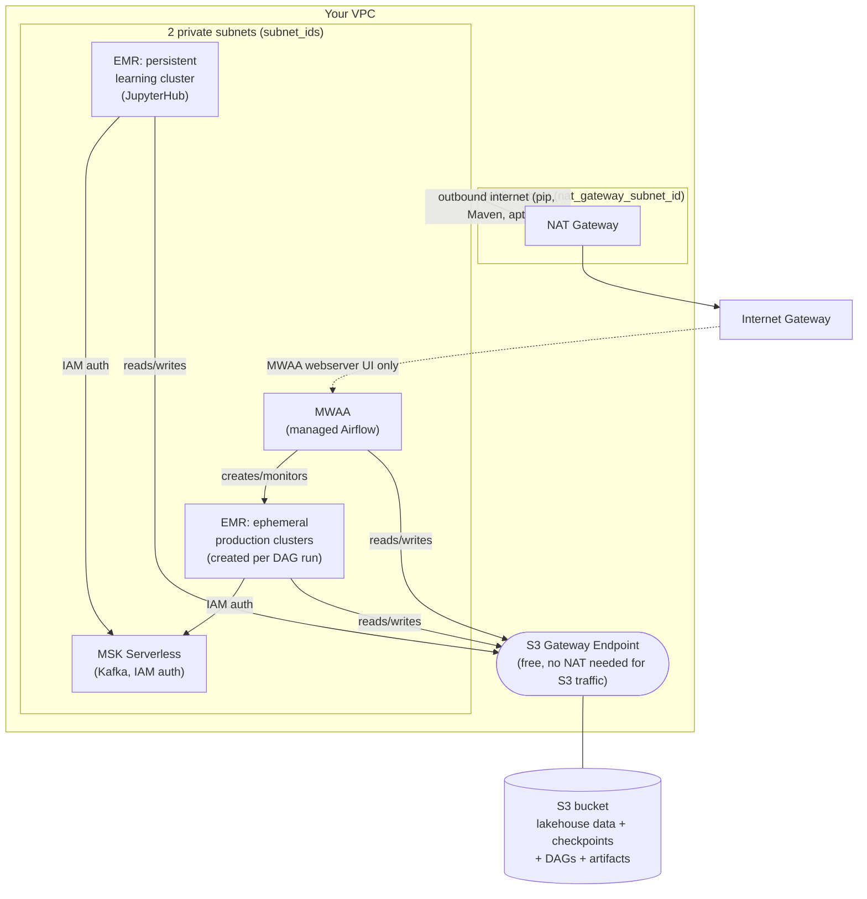
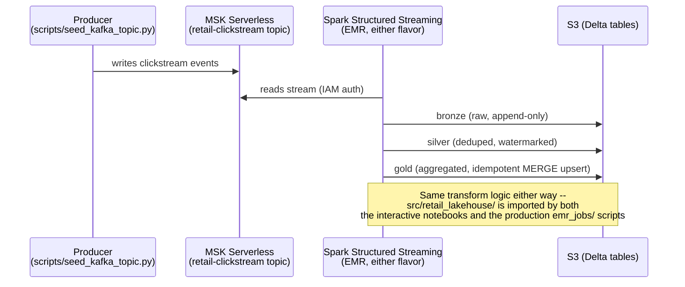
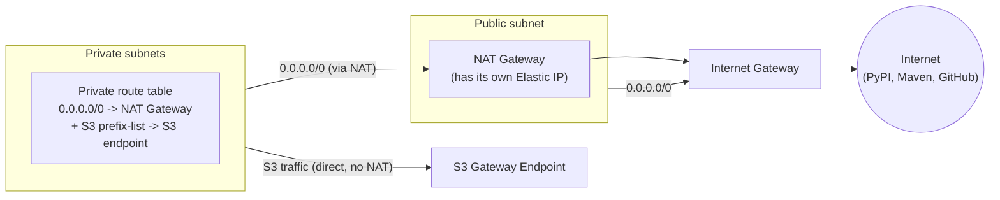
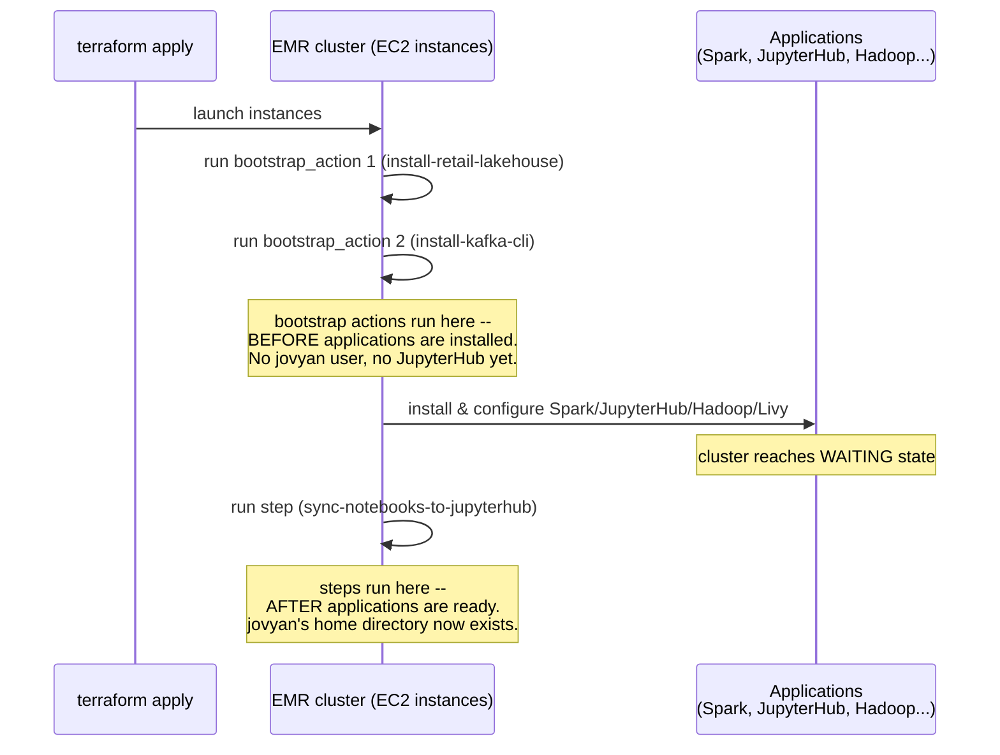

# Infrastructure & Terraform, End to End

**Who this is for:** you've never used Terraform before, and you want to understand not just *how to run*
`infra/terraform/`, but *what it actually builds* and *why it's built that way*. Read this once, top to
bottom, before touching `RUNBOOK_AWS.md` — that document tells you what commands to type; this one tells
you what's actually happening when you type them.

---

## Part 1 — What Terraform is, in plain terms

Without Terraform, setting up this project's AWS infrastructure means clicking through the AWS Console (or
running dozens of `aws` CLI commands) to create an S3 bucket, a Kafka cluster, an EMR cluster, an Airflow
environment, IAM roles, security groups, and network plumbing — in the right order, with the right IDs
wired into each other. Do that by hand twice and you'll get two slightly different results. Do it a third
time after forgetting a step, and something breaks in a way that's hard to trace back to "the thing I
clicked differently."

Terraform replaces "click/type the steps" with **describe the end state you want, in a file, and let a
tool figure out the steps.** You write down "an S3 bucket named X, an EMR cluster with these settings, an
IAM role that trusts EC2," and Terraform:

1. Compares what you described against what actually exists in AWS right now.
2. Computes the minimal set of create/update/destroy API calls to close the gap.
3. Runs those calls in the correct dependency order (it won't try to create an EMR cluster before the
   subnet it lives in exists).
4. Records what it created in a **state file**, so next time it knows what's already there.

This is "Infrastructure as Code" (IaC): the `.tf` files *are* the infrastructure's definition, checked into
git like any other code, reviewable in a PR, reproducible by anyone with the right AWS credentials.

### The core vocabulary

| Term | What it means | Where you'll see it in this repo |
|---|---|---|
| **Provider** | A plugin that knows how to talk to a specific API (AWS, in this case). Declared once. | `versions.tf`: `provider "aws" { region = var.aws_region }` |
| **Resource** | One real thing Terraform manages the full lifecycle of (create/update/destroy). | `resource "aws_s3_bucket" "lakehouse" { ... }` |
| **Data source** | A *read-only* lookup of something that already exists (Terraform doesn't manage its lifecycle). | `data "aws_caller_identity" "current" {}` in `s3.tf` — reads your AWS account ID |
| **Variable** | An input parameter to the whole configuration, supplied via `.tfvars` or the CLI. | `variable "vpc_id" { type = string }` in `variables.tf` |
| **Output** | A value Terraform prints after applying (or that you can query later with `terraform output`). | `output "lakehouse_bucket_name" { value = ... }` |
| **State** | Terraform's private record of what it created and their real AWS IDs. Lives in `terraform.tfstate` (gitignored — it's environment-specific, and can contain sensitive values). | `infra/terraform/terraform.tfstate` |
| **Dependency graph** | Terraform's internal map of "resource A must exist before resource B can be created." Built automatically from references between resources (see Part 4). | — |

### The four commands you'll actually run

```
terraform init      # downloads the AWS provider plugin, sets up the local working directory
terraform plan      # shows what WOULD change, without changing anything -- always read this before apply
terraform apply     # actually creates/updates/destroys resources to match your .tf files
terraform destroy   # tears down everything Terraform created
```

`plan` is your safety net. It's a dry run — read its output like a diff (`+` to create, `-` to destroy,
`~` to update in place) before typing `yes` on an `apply`.

---

## Part 2 — This project's architecture

At a glance, `infra/terraform/` builds this (the full picture, with `var.enable_mwaa = true` — by
default MWAA, the NAT Gateway, and the "public subnet"/"private subnets" split simply don't exist, and
`subnet_ids` are just used as-is by MSK and EMR):



Read this diagram as two separate concerns layered on the same network:

- **The private subnets** hold everything that processes or stores data: the Kafka cluster, both flavors
  of EMR cluster, and MWAA's own infrastructure. None of it is reachable directly from the internet.
- **The NAT Gateway**, sitting alone in a public subnet, is the only way anything in the private subnets
  reaches the outside world (PyPI, Maven Central, GitHub releases) — see Part 3 for why this exists at all.
- **The S3 Gateway Endpoint** is a shortcut: S3 traffic (which is most of this project's actual data
  volume — Delta tables, checkpoints, notebooks, the packaged wheel) goes straight to S3 over AWS's
  internal network, bypassing the NAT Gateway entirely. This is why it exists: NAT charges per GB, the S3
  endpoint doesn't.

### Component by component

| Component | Terraform file | What it is | Why it's here |
|---|---|---|---|
| **S3 bucket** | `s3.tf` | One bucket holding Delta table data (`data/tables/`), streaming checkpoints (`data/checkpoints/`), seed files (`data/source/`), MWAA's DAGs (`airflow/`), and build artifacts (`artifacts/`, `bootstrap/`) | The lakehouse's actual storage layer — everything downstream reads/writes here |
| **MSK Serverless** | `msk.tf` | A Kafka cluster, IAM-authenticated, no broker sizing to manage | The "clickstream" event source the pipeline streams from |
| **EMR learning cluster** | `emr_learning.tf` | A persistent cluster running Spark + JupyterHub + Livy + Hadoop | Where you run the teaching notebooks (`class-emr/`, `emr-notebooks/`) interactively |
| **MWAA** *(optional, off by default)* | `mwaa.tf` | Managed Apache Airflow | Orchestrates the *production* pipeline: creates a fresh, throwaway EMR cluster per scheduled run, runs the pipeline as Spark steps, then terminates it. Every resource in this file is gated behind `var.enable_mwaa` — the interactive path (learning cluster + notebooks) doesn't need it at all |
| **Networking** | `networking.tf` | An S3 Gateway Endpoint always; a NAT Gateway, its EIP, and a dedicated private route table only when `var.enable_mwaa = true` | The S3 endpoint saves NAT costs whenever there's a NAT Gateway. The NAT Gateway itself only exists to satisfy MWAA's "no public subnets" rule (see Part 3) — MSK and EMR don't require private subnets at all |
| **IAM** | `iam.tf` | The EC2 instance role/profile EMR nodes assume, the EMR service role, and their policies (S3, MSK, Glue) | Lets EMR nodes talk to S3/MSK/Glue *ambiently* — no access keys anywhere on the cluster |

Notice the architectural split: **the persistent learning cluster** (`emr_learning.tf`) and **MWAA's
ephemeral clusters** are two separate answers to "run Spark," for two separate audiences — one for a human
exploring interactively, one for a schedule running unattended. They share the same IAM role, the same S3
bucket, and the same MSK cluster; they just have very different lifecycles (one lives until you destroy it,
the other lives for the duration of one pipeline run).

### The data flow



The pipeline logic itself (`src/retail_lakehouse/`) doesn't know or care whether it's running inside a
notebook cell on the learning cluster or as a `spark-submit` step on an ephemeral MWAA-created cluster —
it's the same installed Python package (the wheel) either way. That's a deliberate design choice: the
notebooks *teach* the pipeline, `emr_jobs/` + the MWAA DAG *run* the same pipeline on a schedule. Neither
reimplements the other's logic.

---

## Part 3 — Networking, the part that actually causes the most trouble

This is worth its own section because it's genuinely the least intuitive part of this whole setup, and the
part most likely to produce confusing errors the first time you touch it.

**The rule that drives everything here:** MWAA refuses to run in a "public" subnet — one whose route
table sends `0.0.0.0/0` straight to an Internet Gateway. It requires **private** subnets: ones that route
`0.0.0.0/0` to a **NAT Gateway** instead. (MSK Serverless and EMR have no such requirement — this whole
section only matters if `var.enable_mwaa = true`.)



Why the asymmetry? A NAT Gateway is itself an internet-facing thing — it needs a public IP and a direct
route to the Internet Gateway to work at all. So it **can't live inside the private subnets it serves**
(that would be circular: a private subnet routes to the NAT, but the NAT would have nowhere to route to).
Something has to stay public to host it. That's exactly what `var.nat_gateway_subnet_id` is: one subnet
that stays public, purely to hold the NAT Gateway, while `var.subnet_ids` (2 subnets) become private and
route through it.

`networking.tf` builds this: an Elastic IP, a NAT Gateway in the public subnet, a *new, dedicated* route
table for the 2 private subnets (rather than mutating whatever route table they already had — safer, since
other things in your VPC might depend on that original table), and the S3 Gateway Endpoint attached to
every route table in the VPC.

**One thing Terraform can't fully automate here:** if your 2 "private" subnets started life as ordinary
public subnets (common — most default VPCs only have public subnets), fixing their *route table* isn't
enough on its own. EC2 subnets also carry a `MapPublicIpOnLaunch` attribute — a separate, independent
signal of "this subnet hands out public IPs by default" — and MWAA checks *that* too, not just the route
table. If you hit `ValidationException: The subnets must be private` even after `networking.tf` applies
cleanly, this attribute is almost always why (see `RUNBOOK_AWS.md`'s Troubleshooting section for the exact
fix — it's a one-line `aws ec2 modify-subnet-attribute` call, not a Terraform change).

---

## Part 4 — What actually happens when you run `terraform apply`

### The dependency graph

Terraform doesn't run your `.tf` files top to bottom. It builds a graph from **references** between
resources, and executes it in dependency order (creating independent branches in parallel where it can).

A reference looks like `aws_s3_bucket.lakehouse.arn` — using another resource's *attribute*. Terraform sees
that and knows "create `lakehouse` first, then whatever's now referencing its ARN." This is called an
**implicit dependency**, and it's how most of this configuration is wired together — e.g. `iam.tf`'s S3
policy references `aws_s3_bucket.lakehouse.arn`, so Terraform knows the bucket must exist before that
policy can be created.

But some dependencies aren't visible through attribute references at all. `emr_learning.tf`'s EMR cluster
uses `var.subnet_ids[0]` — a plain *variable*, not a resource attribute. Terraform has no way to know from
that alone that this cluster's bootstrap actions need the NAT Gateway and S3 endpoint to already be routed
correctly, because nothing about "the subnet's route table is ready" is expressed in that line. This is
exactly the bug that caused real failures while this project was being built: the EMR cluster would start
launching *before* the private routing was actually in place, and its bootstrap action (which needs to
`aws s3 cp` a wheel from S3) would fail trying to reach the internet/S3 before a route existed.

The fix is an **explicit dependency** — the `depends_on` argument:

```hcl
resource "aws_emr_cluster" "learning" {
  # ...
  depends_on = [
    aws_route_table_association.private, aws_vpc_endpoint.s3,
    aws_s3_object.emr_notebooks, aws_s3_object.class_emr_notebooks,
  ]
  # ...
}
```

This tells Terraform, in effect: "even though nothing in this resource block *references* these things,
don't even attempt to create me until they're done." You'll see `depends_on` scattered through this
project's `.tf` files anywhere a resource's real-world correctness depends on something Terraform's
automatic graph-building can't see on its own.

### Bootstrap actions vs. steps — a timing distinction that matters

EMR clusters (`emr_learning.tf`) support two different ways to run custom code on the cluster, and mixing
them up produces confusing failures:



**Bootstrap actions** run early, before any of the requested applications are installed — they're for
node-level setup (installing packages, CLI tools, Python dependencies). **Steps** run once the cluster and
its applications are fully up — they're for anything that depends on an application already being
initialized. This project learned that distinction the hard way: an earlier attempt tried to copy notebook
files into JupyterHub's user directory *as a bootstrap action*, which is structurally too early — that
user directory doesn't exist yet at that point. The fix (`emr_learning.tf`'s `step { }` block) moved it to
run after the cluster is ready instead.

### For-each and dynamic file uploads

`emr_learning.tf` uploads every notebook automatically, without listing filenames one by one:

```hcl
resource "aws_s3_object" "emr_notebooks" {
  for_each = fileset("${path.module}/../../emr-notebooks", "*.ipynb")
  bucket   = aws_s3_bucket.lakehouse.id
  key      = "notebooks/emr-notebooks/${each.value}"
  source   = "${path.module}/../../emr-notebooks/${each.value}"
  etag     = filemd5("${path.module}/../../emr-notebooks/${each.value}")
}
```

`fileset(...)` scans a directory at plan time and returns every matching filename; `for_each` then creates
one `aws_s3_object` resource *per file* — add a new notebook to `emr-notebooks/` and the next
`terraform apply` uploads it automatically, no `.tf` edit required. The `etag` (an MD5 hash of the file's
content) is how Terraform notices a notebook's content *changed* and needs re-uploading, even though the
filename (and therefore the S3 key) stayed the same.

---

## Part 5 — Reading `infra/terraform/`, file by file

```
infra/terraform/
├── versions.tf        Pins the Terraform version and the AWS provider version. First thing read on init.
├── variables.tf        Every input this configuration needs (vpc_id, subnet_ids, instance sizes, ...).
├── terraform.tfvars.example   A template for the real terraform.tfvars you create yourself (gitignored).
├── s3.tf               The lakehouse bucket + versioning + encryption + lifecycle rules.
├── networking.tf        NAT Gateway, private route table, S3 Gateway Endpoint. See Part 3.
├── iam.tf               EMR's EC2 instance role/profile + service role + their S3/MSK/Glue policies.
├── msk.tf               MSK Serverless cluster + its security groups.
├── emr_learning.tf       The persistent JupyterHub cluster + notebook auto-upload + notebook sync step.
├── mwaa.tf               The managed Airflow environment.
├── outputs.tf            The `next_steps` text printed after a successful apply.
└── bootstrap/
    ├── install_retail_lakehouse.sh   Installs the retail_lakehouse wheel (runs on every EMR node).
    └── install_kafka_cli.sh          Installs kafka-topics.sh + the IAM-auth jar (learning cluster only).
```

Notice what's conspicuously *not* here: there's no `vpc.tf` or subnet-creation code anywhere. The VPC and
its subnets are treated as a **prerequisite you bring**, not something this configuration provisions —
that's a deliberate scope boundary (see the comments in `variables.tf` on `vpc_id`/`subnet_ids`).

---

## Part 6 — What this actually costs, and why

Two things bill **continuously** by default, whether or not you're actively using them, from the moment
`terraform apply` finishes until you tear them down:

| Resource | Bills for |
|---|---|
| MSK Serverless | Partition-hours + GB in/out/retained — even fully idle |
| EMR learning cluster | EC2 instance-hours (master + core nodes) + EBS storage, for as long as it exists |

Plus, only if you opted into `var.enable_mwaa = true`: MWAA itself (hourly by environment class, no
free/idle tier) and the NAT Gateway its private-subnet requirement pulls in (hourly + per-GB).

**This is why `RUNBOOK_AWS.md` insists on `terraform destroy` when you're done with a session.** Unlike a
typical web app's infrastructure (which you might leave running indefinitely because idle compute is
cheap), this stack was chosen specifically because it's *realistic production infrastructure* for
teaching purposes — and realistic production infrastructure costs real money around the clock.

---

## Part 7 — Lessons from actually building this

If you want to see exactly what going wrong looks like — real error messages, real root causes, real
fixes — `RUNBOOK_AWS.md`'s **Troubleshooting** section is a log of every failure hit while this project was
built and debugged: an EMR instance type silently rejected, a bootstrap script's wheel-filename bug, a
Python version mismatch between the build environment and EMR's runtime, a broken "latest release" GitHub
URL, IAM permissions MWAA's own validation needs but doesn't document clearly, and the subnet/NAT ordering
issues covered in Part 3 and Part 4 here. None of it was exotic — every single one was a specific,
diagnosable mistake, found by reading the actual error message and the actual logs (never by guessing
twice). That's the debugging habit worth taking away as much as anything about Terraform syntax:
**when something fails, go find the real log before changing anything.**

---

## Where to go next

- **Never touched a terminal command in this repo?** Start with `README.md`'s "Where to start" section.
- **Ready to actually run this?** `RUNBOOK_AWS.md` is the step-by-step, in order, including prerequisites
  and teardown.
- **Want to understand Spark/Kafka/Delta concepts themselves, not the infrastructure around them?**
  `class-emr/01` through `04` and `emr-notebooks/00` through `07` are where that lives.
